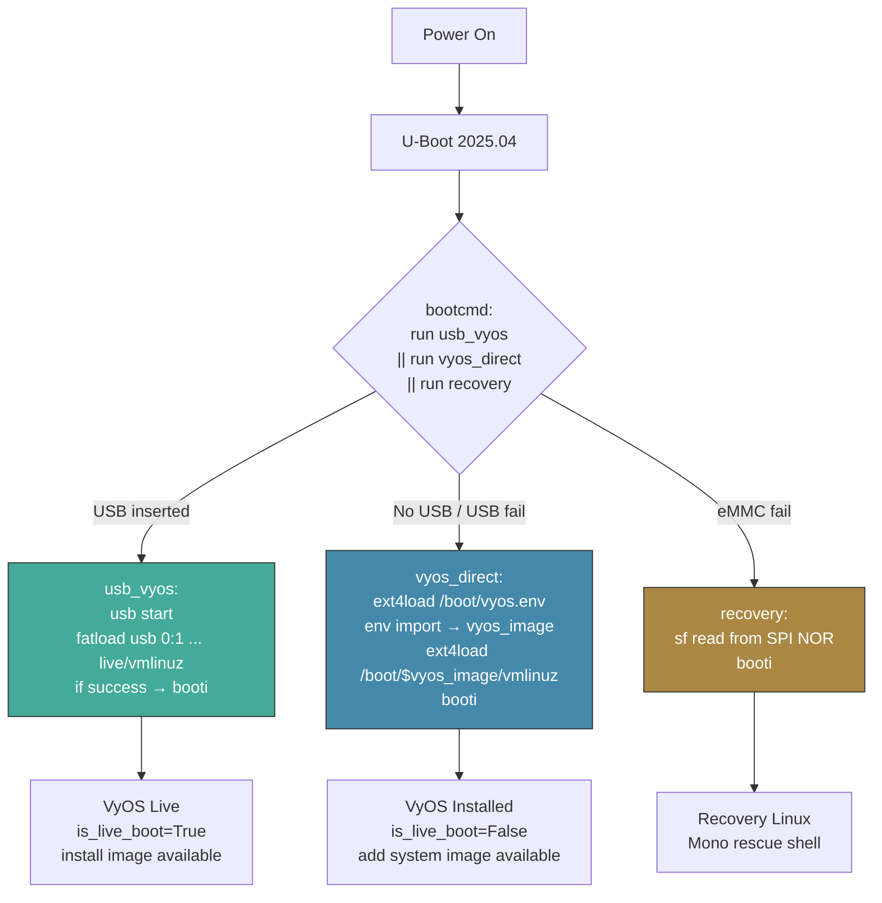
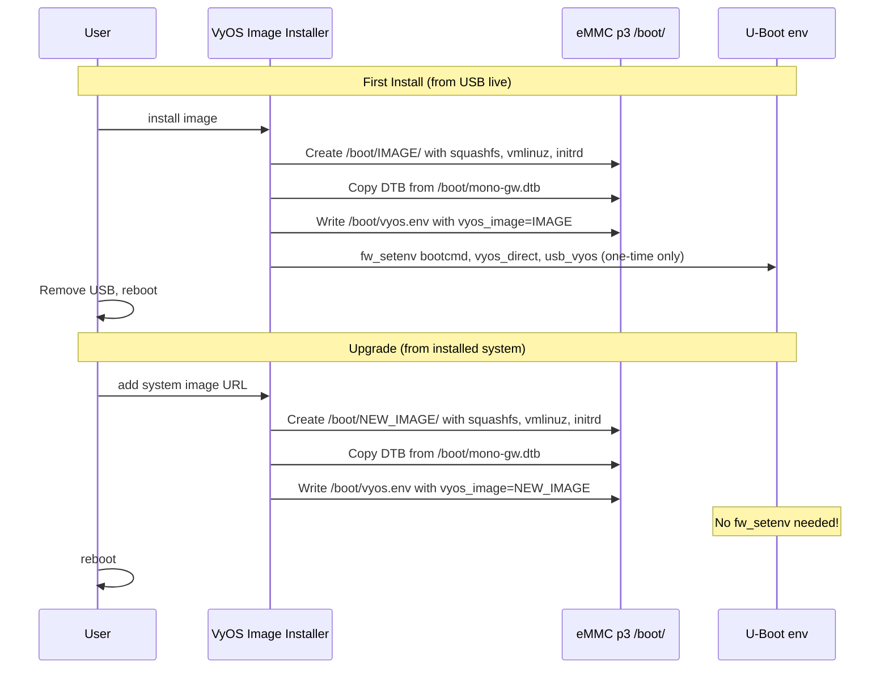

# VyOS LS1046A Seamless Boot Specification

> **Goal:** Make VyOS on the Mono Gateway boot, install, and upgrade with the same user experience as VyOS on x86 — no manual U-Boot commands after initial one-time setup. Eliminate `vyos-postinstall` as a user-facing tool.

## The Key Insight: Replace `fw_setenv` with a Boot Config File

The current architecture uses `fw_setenv` to write the image name into U-Boot's SPI flash environment on every install/upgrade. This requires:
- `libubootenv-tool` package
- `/etc/fw_env.config` pointing to `/dev/mtd3`
- `CONFIG_SPI_FSL_QSPI=y` for MTD access
- A helper script (`vyos-postinstall`) called manually or hooked into every install path

**Alternative:** U-Boot reads the default image name from a text file on the eMMC ext4 partition. VyOS writes this file as part of its normal image management. No SPI flash writes needed.

### How It Works

**On eMMC partition 3 (ext4):**
```
/boot/vyos.env                           ← text file: vyos_image=2026.03.24-0338-rolling
/boot/2026.03.24-0338-rolling/
    vmlinuz
    initrd.img
    mono-gw.dtb
    2026.03.24-0338-rolling.squashfs
```

**U-Boot `vyos_direct` command:**
```bash
vyos_direct=ext4load mmc 0:3 ${load_addr} /boot/vyos.env; env import -t ${load_addr} ${filesize}; ext4load mmc 0:3 ${kernel_addr_r} /boot/${vyos_image}/vmlinuz; ext4load mmc 0:3 ${fdt_addr_r} /boot/${vyos_image}/mono-gw.dtb; ext4load mmc 0:3 ${ramdisk_addr_r} /boot/${vyos_image}/initrd.img; setenv bootargs "BOOT_IMAGE=/boot/${vyos_image}/vmlinuz console=ttyS0,115200 earlycon=uart8250,mmio,0x21c0500 net.ifnames=0 boot=live rootdelay=5 noautologin fsl_dpaa_fman.fsl_fm_max_frm=9600 hugepagesz=2M hugepages=512 panic=60 vyos-union=/boot/${vyos_image}"; booti ${kernel_addr_r} ${ramdisk_addr_r}:${filesize} ${fdt_addr_r}
```

**VyOS side:** After `install image` or `add system image`, VyOS writes:
```
vyos_image=<new-image-name>
```
to `/boot/vyos.env`. This is a one-line text file write — trivially triggered from VyOS's image installer Python code.

### Why This Is Better

| Aspect | `fw_setenv` approach | `vyos.env` file approach |
|--------|---------------------|------------------------|
| Flash writes | SPI NOR (wear-limited) | eMMC ext4 (wear-leveled) |
| Dependencies | `libubootenv-tool`, `/dev/mtd3`, QSPI driver | None — just a text file |
| Risk of bricking | SPI env corruption = no boot | eMMC file corruption = fallback to SPI recovery |
| Complexity | Shell script with board detection + fw_setenv | One `echo` command in Python |
| Per-boot service | `vyos-postinstall.service` runs every boot | Not needed |
| Integration with VyOS | External script, manually called | Inline in `image_installer.py` |

---

## Architecture

### Boot Chain



### Image Lifecycle



### When `fw_setenv` Is Still Needed

Only **once** — during the very first `install image` from USB live boot. This sets:
- `bootcmd` = `run usb_vyos || run vyos_direct || run recovery`
- `vyos_direct` = the command that reads `/boot/vyos.env` and boots from it
- `usb_vyos` = auto-detect and boot from USB

After this one-time setup, **all future installs and upgrades only write `/boot/vyos.env`** — a plain text file on the eMMC ext4 partition. No more SPI flash writes.

---

## Detailed Implementation (Completed)

### 1. Hook into `grub.set_default()` (`python/vyos/system/grub.py`)

Rather than patching every call site in `image_installer.py` and `image_manager.py`, we hook into `grub.set_default()` — the single convergence point for all operations that change the default boot image. This covers:
- `install image` → `install_image()` calls `grub.set_default()`
- `add system image` → `add_image()` calls `grub.set_default()`
- `set system image default-boot` → `set_default_image()` calls `grub.set_default()`
- `rename image` → `rename_image()` calls `grub.set_default()`

The hook writes `vyos_image=<name>\n` to `/boot/vyos.env` using `Path.write_text()`. On non-U-Boot systems, this file is harmless (ignored by GRUB).

### 2. Call `vyos-postinstall` from `install_image()` (`src/op_mode/image_installer.py`)

After `grub.set_default()` in `install_image()`, we call `run('vyos-postinstall')` for the one-time U-Boot env setup (`fw_setenv`). This is the only call site — `add_image()` doesn't need it because the U-Boot env is already static.

### 3. Simplified `vyos-postinstall` (`/usr/local/bin/vyos-postinstall`)

The script handles:
- **Always:** Write `/boot/vyos.env` with the auto-detected latest image name
- **First time only:** Run `fw_setenv` to set `bootcmd`, `vyos_direct`, and `usb_vyos`

Detection of "first time" — check if `fw_printenv vyos_direct` already contains `vyos.env`. If yes, skip the `fw_setenv` step. Script reduced from 229 to ~130 lines.

### 3. U-Boot Environment (Set Once)

```bash
# bootcmd — try USB, then eMMC via vyos.env, then SPI recovery
bootcmd=run usb_vyos || run vyos_direct || run recovery

# USB live boot — auto-detect VyOS ISO on FAT32 USB
usb_vyos=usb start; if fatload usb 0:1 ${kernel_addr_r} live/vmlinuz; then fatload usb 0:1 ${fdt_addr_r} mono-gw.dtb; fatload usb 0:1 ${ramdisk_addr_r} live/initrd.img; setenv bootargs "BOOT_IMAGE=/live/vmlinuz console=ttyS0,115200 earlycon=uart8250,mmio,0x21c0500 boot=live live-media=/dev/sda1 components noeject nopersistence noautologin nonetworking union=overlay net.ifnames=0 fsl_dpaa_fman.fsl_fm_max_frm=9600 quiet"; booti ${kernel_addr_r} ${ramdisk_addr_r}:${filesize} ${fdt_addr_r}; fi

# eMMC boot — read image name from vyos.env, then load and boot
vyos_direct=ext4load mmc 0:3 ${load_addr} /boot/vyos.env; env import -t ${load_addr} ${filesize}; ext4load mmc 0:3 ${kernel_addr_r} /boot/${vyos_image}/vmlinuz; ext4load mmc 0:3 ${fdt_addr_r} /boot/${vyos_image}/mono-gw.dtb; ext4load mmc 0:3 ${ramdisk_addr_r} /boot/${vyos_image}/initrd.img; setenv bootargs "BOOT_IMAGE=/boot/${vyos_image}/vmlinuz console=ttyS0,115200 earlycon=uart8250,mmio,0x21c0500 net.ifnames=0 boot=live rootdelay=5 noautologin fsl_dpaa_fman.fsl_fm_max_frm=9600 hugepagesz=2M hugepages=512 panic=60 vyos-union=/boot/${vyos_image}"; booti ${kernel_addr_r} ${ramdisk_addr_r}:${filesize} ${fdt_addr_r}
```

Key: `vyos_direct` is now **static** — it never needs to change. The image name comes from `/boot/vyos.env` at boot time.

### 4. `/boot/vyos.env` Format

Single line, U-Boot `env import -t` compatible:
```
vyos_image=2026.03.24-0338-rolling
```

Written by patched `grub.set_default()` on every `install image`, `add system image`, or `set system image default-boot`. Also written by `vyos-postinstall` as a safety net.

### 5. `set system image default-boot` Integration

Automatically covered by the `grub.set_default()` hook — no additional code needed.

---

## Files Modified

| File | Change | Status |
|------|--------|--------|
| `data/scripts/vyos-postinstall` | Rewritten: write `vyos.env` + one-time `fw_setenv` for static `vyos_direct` | ✅ Done |
| `data/vyos-1x-011-vyos-env-boot.patch` | Hook `vyos.env` write into `grub.set_default()` + call `vyos-postinstall` in `install_image()` | ✅ Done |
| `.github/workflows/auto-build.yml` | Apply patch 011; update service description | ✅ Done |
| `INSTALL.md` | Simplified to 5 steps (removed manual U-Boot config step) | ✅ Done |
| `UBOOT.md` | Document new boot architecture | ✅ Done |
| `AGENTS.md` | Added `vyos.env` rules, updated file table | ✅ Done |
| `PORTING.md` | Updated Fix 7 and patch table | ✅ Done |

---

## User Experience

### First Install (one-time U-Boot interaction)

1. Write ISO to USB (Rufus/dd)
2. Insert USB, power on, interrupt U-Boot, paste ONE line
3. VyOS Live boots, run `install image`
4. `install image` auto-writes `vyos.env` + auto-sets U-Boot env
5. Remove USB, reboot → VyOS from eMMC

### All Subsequent Operations (zero U-Boot interaction)

- **`add system image URL`** → auto-updates `vyos.env` → reboot loads new image
- **Insert USB + power cycle** → U-Boot auto-detects USB, boots live for re-install
- **`set system image default-boot <image>`** → updates `vyos.env` → next reboot uses it

---

## Risk Analysis

| Risk | Impact | Mitigation |
|------|--------|------------|
| U-Boot `env import -t` not available on this U-Boot version | Entire approach broken | U-Boot 2025.04 supports it — verify on hardware first |
| `vyos.env` corrupted/missing | eMMC boot fails | `recovery` fallback in `bootcmd`; can also add inline default |
| `usb_vyos` adds 3-4s to eMMC boot | Minor UX | Acceptable for seamless USB |
| `env import` overwrites unrelated vars | Side effects | `vyos.env` only contains `vyos_image=` — no collision risk |
| VyOS upstream changes `grub.set_default()` | Patch 011 breaks | Monitor vyos-1x; patch is 7 lines in grub.py + 6 lines in image_installer.py |

---

## Success Criteria

1. `install image` writes `vyos.env` and sets U-Boot env automatically
2. `add system image` writes `vyos.env` — no `fw_setenv`, no `vyos-postinstall` needed
3. Reboot after upgrade loads new image via `vyos.env`
4. USB re-install works automatically (no U-Boot interaction)
5. `set system image default-boot` switches boot target via `vyos.env`
6. `vyos-postinstall` only needed once (first install) — not a user-facing tool
