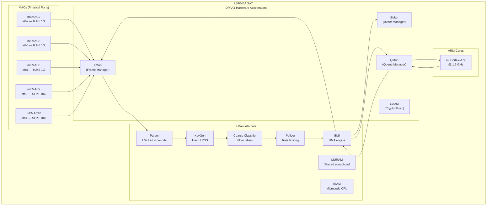
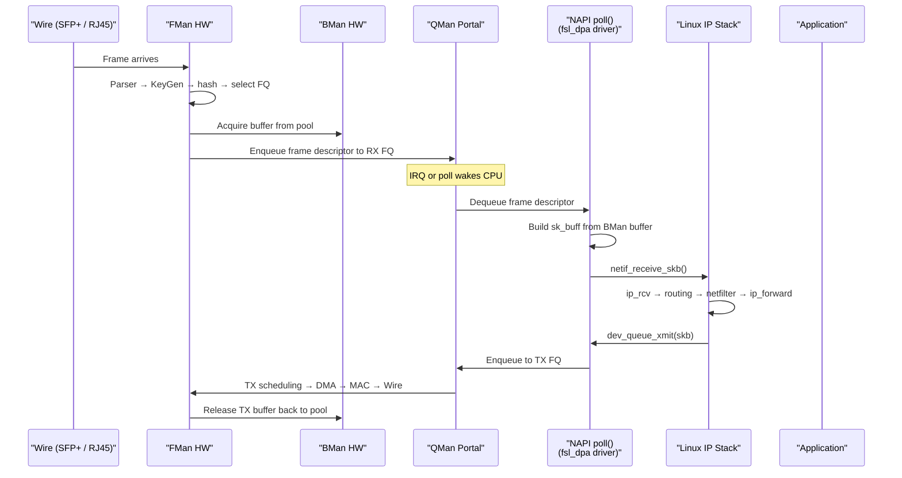
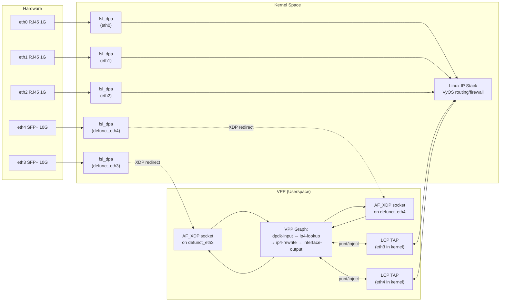
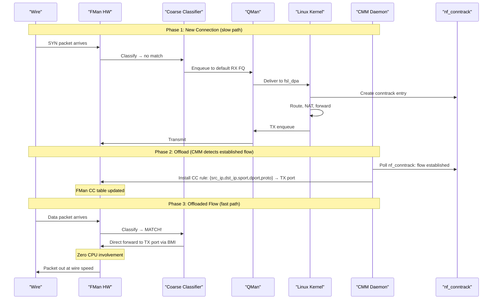
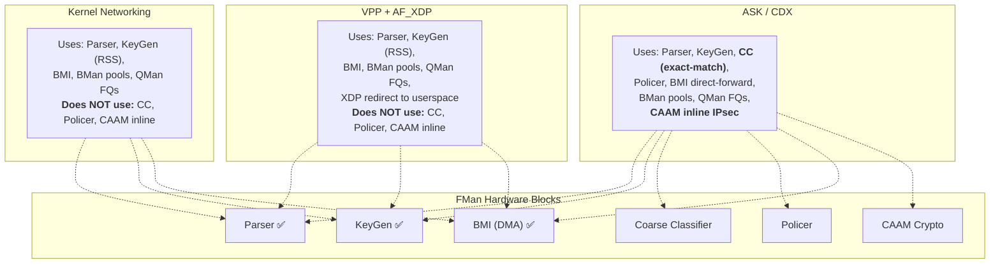
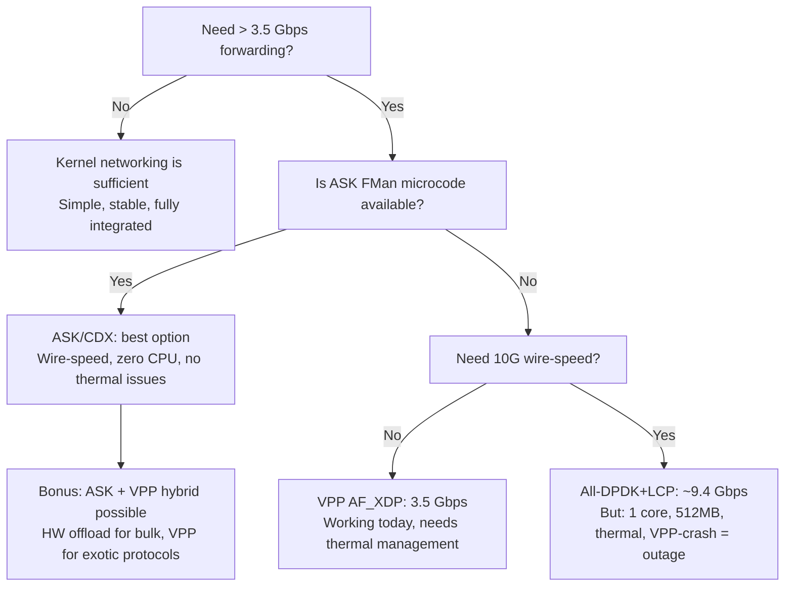

# LS1046A Networking Architecture Deep Dive

> **Audience:** Engineers evaluating packet forwarding options for the NXP LS1046A
> (Mono Gateway Development Kit) running VyOS.
>
> **Updated:** 2026-04-04 — AF_XDP confirmed working on hardware.

---

## 1. The Hardware: What the Silicon Actually Does

Before comparing software approaches, it's essential to understand what the LS1046A
puts in silicon versus what runs on the four Cortex-A72 cores.

### 1.1 Block Diagram



### 1.2 What Runs in Hardware vs. Microcode vs. Software

| Function | Where It Runs | What It Does |
|----------|--------------|-------------|
| **Ethernet MAC** | Silicon (mEMAC) | SerDes, PHY interface, CRC, flow control, pause frames. Pure hardware. |
| **Frame Parser** | FMan microcode CPU (IRAM) | Walks L2→L3→L4 headers. Produces a **Parse Result** array (protocol offsets, flags, L4 type). Runs NXP proprietary microcode on a dedicated RISC core inside FMan — not on Cortex-A72. |
| **KeyGen (RSS)** | FMan hardware | Computes hash over Parse Result fields (src/dst IP, ports). Selects one of 128 hardware Frame Queues for per-flow distribution. Fully in silicon — the hash function is gate-level logic. |
| **Coarse Classifier** | FMan hardware | TCAM-like lookup against a table of rules loaded via FMC tool. Can match on any Parse Result field and route to specific FQs, policers, or directly to a TX port. This is the heart of ASK offloading. |
| **Policer** | FMan hardware | Dual-rate token-bucket per-flow rate limiting. Pure silicon. |
| **BMI (DMA)** | FMan hardware | Moves frame data between system DDR4 and FMan internal FIFO. Fetches buffers from BMan pools via hardware command interface. No CPU involvement. |
| **BMan** | Dedicated hardware block | Manages pools of buffer pointers. Acquire/release operations are atomic hardware commands (~15 ns each). No CPU cache pollution. |
| **QMan** | Dedicated hardware block | 64K hardware Frame Queues with priority scheduling, congestion avoidance (WRED), and hold-active affinity. Enqueue/dequeue are hardware doorbell writes. |
| **QMan Portals** | Memory-mapped registers | Each CPU core gets a dedicated portal (cache-inhibited doorbell region). Dequeue is an MMIO read. No interrupt needed for poll-mode. |
| **CAAM** | Dedicated crypto engine | AES, SHA, IPsec ESP/AH. Hardware scatter-gather with its own DMA. Can process frames inline with FMan via a special "offline port" path. |

### 1.3 The FMan Microcode — What's Actually in It

FMan's Parser runs on a proprietary RISC processor inside FMan with its own instruction
RAM (IRAM) and multi-user RAM (MURAM). U-Boot loads the microcode binary from SPI flash
(partition `mtd4`, file `fsl_fman_ucode_ls1046_r1.0_106_4_18.bin`) and injects it into
the DTB `fsl,fman-firmware` node before kernel handoff.

**Standard microcode** (what ships with the board):
- L2 Ethernet header parsing (VLAN, QinQ, MPLS, PPPoE)
- L3 IP parsing (IPv4/IPv6 options, fragments, tunnels)
- L4 protocol identification (TCP, UDP, SCTP, GRE)
- Produces Parse Result → feeds KeyGen hash → feeds QMan enqueue
- Does NOT make forwarding decisions — it only **classifies**

**ASK-enabled microcode** (NXP v210.10.1, proprietary):
- Everything the standard microcode does, PLUS:
- Extended Coarse Classifier support with larger flow tables
- Hooks for CDX-programmed "exact match" entries that trigger **direct FMan port-to-port forwarding**
- When a classified frame matches a CDX-installed flow entry, FMan routes it directly to the destination TX port via BMI — zero CPU involvement

The critical distinction: **standard microcode classifies but always enqueues to QMan
(which then delivers to a CPU)**. ASK microcode classifies and can optionally **short-circuit
the frame directly to a TX port**, bypassing QMan and all software entirely.

---

## 2. Normal Kernel Networking

### 2.1 The Linux DPAA1 Driver Stack



### 2.2 Per-Packet CPU Cost

Every packet that traverses the kernel stack touches:

| Step | CPU Cost | Cache Impact |
|------|---------|-------------|
| QMan portal dequeue | ~50 ns | Cache-inhibited MMIO read |
| sk_buff allocation + metadata | ~80 ns | L1/L2 cache allocation |
| `netif_receive_skb()` / GRO | ~100 ns | Protocol demux, NAPI bookkeeping |
| Netfilter/conntrack | ~200-500 ns | Hash table walk, per-connection state |
| IP routing lookup (FIB) | ~50-100 ns | Radix tree traversal |
| `ip_forward` + TTL/checksum | ~30 ns | Header modification |
| `dev_queue_xmit()` → qdisc | ~100 ns | Queue discipline, possible requeue |
| QMan portal enqueue | ~50 ns | Cache-inhibited MMIO write |
| BMan buffer release | ~15 ns | Hardware command |
| **Total per-packet** | **~700-1100 ns** | **Significant L2 cache pollution** |

At 64-byte packets:
- Theoretical wire: 14.88 Mpps per 10G port
- Kernel forwarding: ~1.0-1.4 Mpps → **~650-900 Mbps**
- At 1500-byte packets: ~300 Kpps → **~3.6 Gbps** (limited by CPU)

### 2.3 DPAA1-Specific Kernel Features

The kernel DPAA1 driver (`fsl_dpa`) takes advantage of hardware acceleration even
in the normal kernel path:

| Feature | How DPAA1 Helps |
|---------|----------------|
| **RSS (Receive Side Scaling)** | FMan KeyGen distributes flows across 128 HW FQs. QMan HOLD_ACTIVE ensures per-flow affinity to a single CPU, minimizing reordering. |
| **Buffer pools** | BMan hardware pool avoids `kmalloc`/`kfree` per-packet. Acquire/release are ~15 ns atomic HW ops vs ~80 ns for `page_alloc`. |
| **TX confirmation** | QMan delivers TX completion back to the driver via a dedicated confirm FQ, enabling zero-copy TX with reliable buffer reclaim. |
| **Priority scheduling** | 4 hardware TX traffic classes with strict priority, no software qdisc needed for basic QoS. |
| **RX/TX checksum** | FMan computes/verifies L3/L4 checksums in hardware. |
| **Scatter-gather** | BMan S/G tables allow zero-copy assembly of fragmented frames. |

**Bottom line:** The kernel path is already hardware-assisted compared to a generic NIC.
The bottleneck is the per-packet sk_buff allocation + IP stack traversal, not the MAC
or DMA.

---

## 3. VPP-Accelerated Networking (VyOS Implementation)

### 3.1 What VPP Is

VPP (Vector Packet Processing) is fd.io's userspace forwarding engine. Instead of
processing one packet at a time through a deep function-call stack (Linux kernel model),
VPP processes **vectors of 256 packets** through a graph of processing nodes — each
node operates on the entire vector before handing it to the next node.

This batching amortizes function-call overhead, keeps instruction cache hot (same code
runs 256 times), and prefetches packet data for the next iteration while the current one
computes.

### 3.2 VyOS Integration — How It Works on the Mono Gateway



### 3.3 The AF_XDP Data Path

AF_XDP uses a shared UMEM ring between kernel and userspace, avoiding the `sk_buff`
allocation and the full IP stack traversal:

| Step | What Happens | Cost |
|------|-------------|------|
| FMan → QMan → kernel | Same as normal: FMan parses, QMan delivers to CPU | ~100 ns |
| XDP program runs | BPF program calls `bpf_redirect_map(&xsks_map, queue_idx, 0)` | ~20 ns |
| Frame lands in UMEM RX ring | Zero-copy: pointer passed to userspace, no `sk_buff` built | ~10 ns |
| VPP reads UMEM batch | Polls RX ring, dequeues up to 256 descriptors at once | ~5 ns/pkt (amortized) |
| VPP graph processing | `ip4-lookup → ip4-rewrite → interface-output` on 256-pkt vector | ~20-50 ns/pkt |
| VPP writes UMEM TX ring | Places outbound frame in TX UMEM slot | ~5 ns/pkt |
| Kernel `sendto()` kick | VPP syscall to wake TX path | ~100 ns (amortized over batch) |
| `dev_direct_xmit()` → QMan | Kernel enqueues to TX FQ, FMan DMAs to wire | ~80 ns |
| **Total per-packet** | | **~250-400 ns** |

**2.5-3× faster** than the kernel stack for the same hardware, because:
- No `sk_buff` allocation (~80 ns saved)
- No netfilter/conntrack traversal (~200-500 ns saved)
- No `qdisc` scheduling (~100 ns saved)
- Vector batching amortizes function-call and syscall overhead

### 3.4 The DPAA1 XDP Queue Index Fix

A critical bug blocked AF_XDP RX on DPAA1: the `fsl_dpa` driver passed the QMan
Frame Queue ID (FQID, typically 32768+) as `queue_index` to `xdp_rxq_info_reg()`.
AF_XDP's XSKMAP has `max_entries=1024`. When `bpf_redirect_map()` looked up
`ctx->rx_queue_index >= 1024`, it always failed → XDP_PASS fallback → AF_XDP received
zero packets.

Fix (in `data/kernel-patches/patch-dpaa-xdp-queue-index.py`): replace `dpaa_fq->fqid`
with `0` in the `xdp_rxq_info_reg()` call, mapping all RX FQs to queue 0.

### 3.5 LCP (Linux Control Plane) Bridge

VPP's LCP plugin renames the real kernel netdevs (`eth3` → `defunct_eth3`) and creates
TAP interfaces with the original names (`eth3`, `eth4`). These TAPs mirror the VPP
interfaces into the kernel:

- **Punt path (VPP → kernel):** ARP, DHCP, BGP, SSH, and other control-plane packets
  are punted from VPP to the TAP device, where the kernel processes them normally.
- **Inject path (kernel → VPP):** Packets originated by the kernel (e.g., ARP replies,
  OSPF hellos) go through the TAP into VPP for transmission on the hardware interface.
- **VyOS sees TAPs as eth3/eth4:** The VyOS CLI, firewall rules, and routing table
  all operate on the TAP interfaces. From VyOS's perspective, eth3/eth4 are normal
  kernel interfaces.

### 3.6 Performance on Mono Gateway Hardware

| Metric | Measured Value | Notes |
|--------|---------------|-------|
| **AF_XDP RX/TX** | Confirmed working | 0% packet loss, 0.5ms RTT to gateway |
| **Theoretical throughput** | ~3.5 Gbps | Per AGENTS.md; limited by copy-mode overhead |
| **CPU usage** | 1 core @ 100% | Poll-mode (`rx-mode polling`) mandatory — DPAA1 AF_XDP doesn't support adaptive |
| **Memory** | ~512 MB hugepages + ~512 MB DPAA1 HW | 1 GB total reserved out of 8 GB |
| **Thermal** | Requires `poll-sleep-usec 100` | Without it: 87°C → thermal shutdown in ~30 min |
| **Max MTU** | 3290 bytes | DPAA1 XDP hardware limit; jumbo not supported on AF_XDP ports |

---

## 4. NXP ASK (Application Solutions Kit) Hardware Offloading

### 4.1 What ASK Is

ASK is an NXP-developed framework that programs the FMan's **Coarse Classifier** to
create hardware-level forwarding fast paths. Unlike VPP (which is a software data plane),
ASK offloads established traffic flows into FMan silicon so that matching packets are
forwarded **entirely in hardware with zero CPU involvement**.

### 4.2 How It Works



### 4.3 ASK Components

| Component | Type | Purpose |
|-----------|------|---------|
| **CDX** | Kernel module (~15K LOC) | Core engine. Programs FMan CC tables. Manages BMan pools, QMan FQs for fast-path. Hooks into `dpaa_eth` driver via `CONFIG_CPE_FAST_PATH`. |
| **CMM** | Userspace daemon (~8K LOC) | Monitors `nf_conntrack` for established flows. Decides what to offload. Tells CDX to install/remove CC entries. Handles NAT rewriting, TTL decrement. |
| **FCI** | Kernel module (~2K LOC) | Netlink-based communication channel between CMM (userspace) and CDX (kernel). |
| **auto_bridge** | Kernel module (~1K LOC) | Detects L2 bridge forwarding flows. Notifies CDX to offload bridge entries (MAC learning). |
| **dpa_app** | Userspace tool (~1K LOC) | Programs initial FMan CC rules from XML policy files via the FMC library. |
| **FMC/fmlib** | NXP libraries | FMan Configuration tool and library. Interface to program FMan's Parser, KeyGen, and CC from userspace. |

### 4.4 The Microcode Dependency

ASK requires **FMan microcode v210.10.1** — a special NXP binary that extends the
Coarse Classifier with support for CDX-programmed exact-match entries. The standard
microcode (`r1.0_106_4_18`) that ships on the board only supports KeyGen-based
distribution (RSS), not exact-match flow forwarding.

| Microcode Version | Capabilities |
|-------------------|-------------|
| **r1.0_106_4_18** (standard) | Parse → KeyGen hash → RSS distribution to FQs. Classify only; always enqueue to QMan for CPU delivery. |
| **v210.10.1** (ASK-enabled) | Parse → KeyGen → CC with exact-match lookup → direct port-to-port forwarding OR enqueue to QMan. |

**This is the hard blocker.** Without the ASK-enabled microcode, CDX cannot install
flow entries and hardware offloading is impossible. The microcode is a proprietary NXP
binary — not open-source, not in the ASK repository.

### 4.5 What ASK Offloads

| Traffic Type | Offloaded? | How |
|-------------|-----------|-----|
| **IPv4 forwarding** (established) | ✅ | CMM watches conntrack, installs CC entry |
| **IPv6 forwarding** (established) | ✅ | Same as IPv4 |
| **NAT** (SNAT/DNAT) | ✅ | CMM encodes NAT rewrite into CC action |
| **IPsec ESP** | ✅ | CAAM crypto + FMan inline processing |
| **L2 bridge forwarding** | ✅ | auto_bridge module + CDX MAC entries |
| **PPPoE** | ✅ | CDX handles PPPoE encap/decap |
| **QoS (CEETM)** | ✅ | Hardware priority queuing |
| **New connections (SYN)** | ❌ | Always through kernel (conntrack must establish first) |
| **DNS / short-lived flows** | ❌ | Connection completes before offload triggers |
| **Custom protocols** | ❌ | Only what FMan CC can match (L2-L4) |
| **Firewall rules** | ⚠️ | Limited to what CC can express; complex ACLs stay in kernel |

---

## 5. What's Actually in Hardware vs. What ASK Adds

This is the key distinction the user asked about. The LS1046A FMan silicon is the same
physical chip regardless of which software stack you run. What changes is **how much of
FMan's capability you use**.

### 5.1 Hardware Capabilities Always Present

These work the same whether you run VyOS, OpenWrt, or bare-metal Linux:

```
┌─────────────────────────────────────────────────────────────────┐
│                    FMan Silicon (always present)                  │
│                                                                   │
│  ┌──────────┐  ┌──────────┐  ┌──────────┐  ┌──────────┐        │
│  │  Parser   │  │  KeyGen  │  │ Policer  │  │   BMI    │        │
│  │ L2-L4    │→│  RSS     │→│  Rate    │→│  DMA     │        │
│  │ decode   │  │  hash    │  │  limit   │  │  engine  │        │
│  └──────────┘  └──────────┘  └──────────┘  └──────────┘        │
│                                                                   │
│  ┌──────────────────────────────────────────────┐                │
│  │  Coarse Classifier (CC) — exists in silicon   │                │
│  │  but UNUSED without ASK-enabled microcode     │                │
│  │  or explicit FMC programming                  │                │
│  └──────────────────────────────────────────────┘                │
│                                                                   │
│  ┌──────────┐  ┌──────────┐                                     │
│  │  mEMAC   │  │  MDIO    │  Ethernet MACs, PHY management     │
│  └──────────┘  └──────────┘                                     │
│                                                                   │
│  ┌──────────┐  ┌──────────┐                                     │
│  │  BMan    │  │  QMan    │  Buffer pools, frame queues         │
│  └──────────┘  └──────────┘                                     │
│                                                                   │
│  ┌──────────┐                                                    │
│  │  CAAM    │  Crypto acceleration (AES, SHA, IPsec)            │
│  └──────────┘                                                    │
└─────────────────────────────────────────────────────────────────┘
```

### 5.2 What Each Software Stack Actually Uses



### 5.3 The Coarse Classifier — The Untapped Hardware

The CC block is the most significant difference. It's a **hardware flow table** inside
FMan that can match on any field the Parser decoded (src/dst MAC, IP, ports, protocol,
VLAN, DSCP) and take actions including:

| CC Action | What It Does | Used By |
|-----------|-------------|---------|
| **Enqueue to FQ** | Normal: deliver to a QMan FQ for CPU processing | Kernel, VPP |
| **Direct forward to TX port** | FMan routes frame to another MAC's TX FIFO via BMI — no QMan, no CPU | **ASK only** |
| **Drop** | Discard frame in hardware | FMC rules, ASK |
| **Policer** | Apply rate limiting before enqueue/forward | ASK, FMC rules |
| **Modify and forward** | NAT rewrite (IP, port, checksum) + forward | **ASK only** |

Without ASK's CDX module programming the CC, this powerful hardware block sits **idle**.
Standard Linux and VPP both route all traffic through QMan → CPU, even though FMan
has the silicon to forward matching flows without touching a CPU at all.

---

## 6. Comparison Matrix

| Dimension | Kernel | VPP (AF_XDP) | ASK (CDX) | VPP DPAA PMD |
|-----------|--------|-------------|-----------|-------------|
| **Where forwarding runs** | CPU (kernel IP stack) | CPU (VPP userspace graph) | FMan silicon (CC) | CPU (VPP + DPDK PMD) |
| **Per-packet CPU cost** | ~700-1100 ns | ~250-400 ns | **0 ns** (offloaded) | ~100-200 ns |
| **10G throughput (1500B)** | ~3.6 Gbps | ~3.5 Gbps | **~9.4 Gbps** (wire) | ~9.4 Gbps |
| **10G throughput (64B)** | ~650 Mbps | ~1.5 Gbps | **~9.4 Gbps** (wire) | ~5 Gbps |
| **CPU cores consumed** | All (interrupt-driven) | 1 (poll-mode) | **0** | 1-2 (poll-mode) |
| **First-packet forwarding** | ✅ Immediate | ✅ Immediate | ❌ After conntrack | ✅ Immediate |
| **Stateless forwarding** | ✅ Any packet | ✅ Any packet | ❌ Only tracked flows | ✅ Any packet |
| **NAT offload** | ❌ Software | ⚠️ VPP plugin | ✅ Hardware | ⚠️ VPP plugin |
| **IPsec offload** | ❌ Software | ❌ No DPAA1 path | ✅ CAAM + FMan | ❌ No DPAA1 path |
| **Thermal impact** | Low (IRQ-driven) | ⚠️ High (poll-mode) | **None** | ⚠️ High (poll-mode) |
| **Memory overhead** | ~0 extra | ~512 MB hugepages | ~0 extra | ~512 MB hugepages |
| **VyOS CLI integration** | ✅ Native | ✅ `set vpp` | ❌ Needs new CLI | ✅ `set vpp` |
| **Management port safety** | ✅ Always | ✅ Kernel-owned | ✅ Kernel-owned | ⚠️ RC#31 blocks |
| **Microcode dependency** | Standard | Standard | 🔴 ASK v210.10.1 | Standard |
| **Kernel patches needed** | 0 | 1 (XDP queue_index) | ~2K LOC | ~1K LOC (USDPAA) |
| **Production status** | ✅ Stable | ✅ Working | 📋 Analysis only | 🔴 Blocked (RC#31) |

---

## 7. The Data Path — Side by Side

### 7.1 Kernel: Every Packet Traverses the Full Stack

```
Wire → FMan(parse+RSS) → BMan(alloc) → QMan(enqueue) → [IRQ/NAPI]
  → CPU: sk_buff alloc → netif_receive_skb → conntrack → routing → netfilter
  → ip_forward → dev_queue_xmit → qdisc → QMan(enqueue) → FMan(DMA) → Wire

  ~12+ context switches through the kernel per packet
  ~700-1100 ns latency
```

### 7.2 VPP AF_XDP: Bypass sk_buff and IP Stack

```
Wire → FMan(parse+RSS) → BMan(alloc) → QMan(enqueue) → [XDP BPF program]
  → redirect to AF_XDP UMEM ring (zero sk_buff) → [poll-mode]
  → VPP: batch 256 pkts → ip4-lookup → ip4-rewrite → interface-output
  → AF_XDP UMEM TX ring → sendto() → dev_direct_xmit → QMan → FMan → Wire

  ~5 context switches per batch of 256 packets
  ~250-400 ns latency per packet
```

### 7.3 ASK: Hardware Short-Circuit (Offloaded Flows)

```
Wire → FMan(parse+RSS) → CC(exact-match LOOKUP → HIT!)
  → BMI(direct forward to TX port) → FMan(DMA+MAC) → Wire

  ZERO context switches. ZERO CPU involvement.
  ~50-100 ns latency (FMan pipeline delay only)
  Wire-speed for any packet size
```

### 7.4 ASK: New Connection (Not Yet Offloaded)

```
Wire → FMan(parse+RSS) → CC(MISS) → BMan → QMan → CPU (same as kernel path)
  → conntrack establishes flow → CMM detects → CDX installs CC entry
  → subsequent packets: FMan hardware fast-path

  First 1-3 packets: kernel speed
  All subsequent packets: wire speed
```

---

## 8. Practical Implications for the Mono Gateway

### 8.1 The 2 GB / 2-Core Production Target

The dev kit has 8 GB / 4 cores. Production (Mono Gateway v1) targets 2 GB / 2 cores.

| Approach | Fits 2GB? | Fits 2 cores? | Notes |
|----------|----------|--------------|-------|
| **Kernel** | ✅ ~200 MB | ✅ All 2 for VyOS | No extra memory/CPU needed |
| **VPP AF_XDP** | ⚠️ 512 MB hugepages = 25% of RAM | ❌ 1 core for VPP = 50% gone | Tight on production HW |
| **ASK** | ✅ ~20 MB for CMM | ✅ All 2 for VyOS | Zero CPU/memory for forwarding |
| **VPP DPDK** | ⚠️ Same as AF_XDP | ❌ Same as AF_XDP | Plus RC#31 blocks it |

### 8.2 Thermal Budget

Without active cooling (production Mono Gateway has a passive heatsink):

| Approach | Steady-State Temp | Sustainability |
|----------|------------------|---------------|
| Kernel (IRQ-driven) | ~45-55°C | ✅ Indefinite |
| VPP (poll-mode) | ~85-87°C | ❌ Thermal shutdown without fan |
| VPP (poll-sleep-usec 100) | ~60-65°C | ⚠️ Marginal, reduces throughput |
| ASK (hardware forwarding) | ~45-55°C | ✅ Same as idle (no CPU load from forwarding) |

### 8.3 Decision Framework



---

## 9. Summary

The LS1046A is a surprisingly capable networking SoC. Its FMan hardware accelerator
does far more than acting as a fancy NIC — it has a full packet parser, flow classifier,
rate policer, and DMA engine in silicon. BMan and QMan add hardware-managed buffer pools
and priority-scheduled work queues.

**What's underutilized today:** The Coarse Classifier (CC) — a hardware flow table that
can forward matching packets directly between ports without any CPU involvement. This
is the capability that ASK unlocks, and it's the difference between "CPU processes every
packet" and "hardware forwards established flows at wire speed."

| Stack | Uses FMan As... | CPU Involvement |
|-------|-----------------|----------------|
| **Linux kernel** | A smart NIC with RSS and checksum offload | Every packet |
| **VPP AF_XDP** | Same as kernel, but bypasses sk_buff allocation | Every packet (faster) |
| **ASK / CDX** | A hardware forwarding engine with flow-programmed fast paths | First packets only; bulk in hardware |

The tradeoff is clear: VPP is available today and well-integrated with VyOS. ASK would
be superior (zero CPU, zero thermal, wire-speed) but requires proprietary NXP microcode
that may or may not be obtainable. For the Mono Gateway production target (2 GB / 2 cores /
passive cooling), ASK's zero-CPU forwarding is architecturally ideal — but VPP AF_XDP
is the proven, working path.

---

## Related Documents

- [VPP.md](../VPP.md) — VPP integration details, CLI reference, thermal management
- [VPP-SETUP.md](../VPP-SETUP.md) — User-facing VPP setup guide
- [ASK-ANALYSIS.md](ASK-ANALYSIS.md) — Detailed ASK component analysis and implementation assessment
- [VPP-DPAA-PMD-VS-AFXDP.md](VPP-DPAA-PMD-VS-AFXDP.md) — DPDK PMD vs AF_XDP cost-benefit analysis
- [PORTING.md](../PORTING.md) — Kernel driver archaeology, DPAA1 boot sequence
- [FMD-SHIM-SPEC.md](FMD-SHIM-SPEC.md) — FMD shim kernel module specification (CDX predecessor concept)