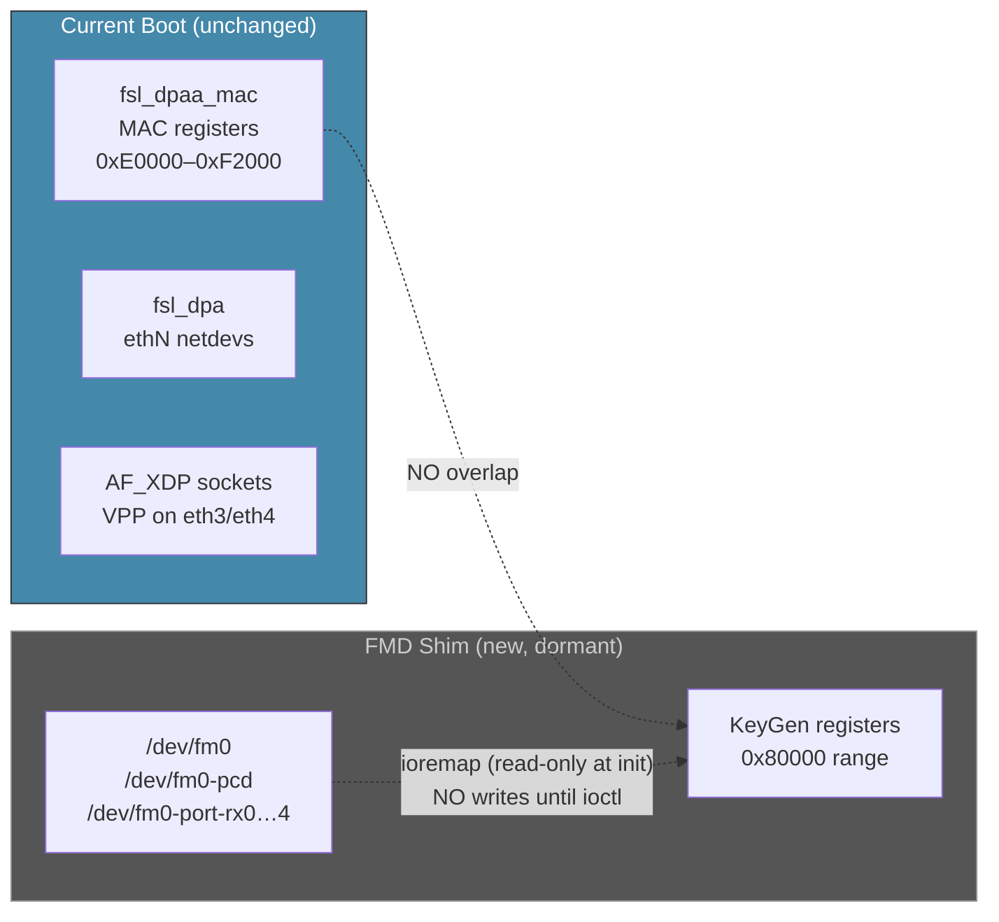
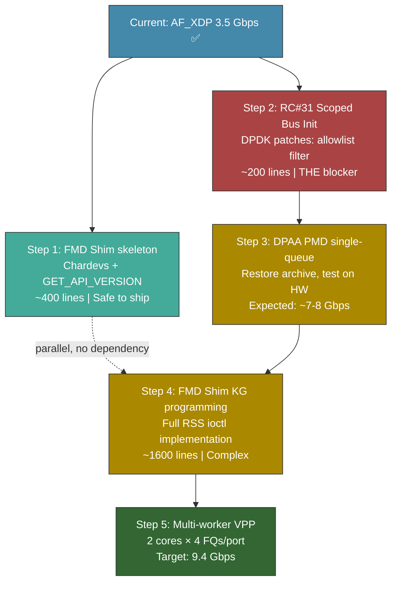

# Next Steps: FMD Shim & Path to 9+ Gbps

> **Created:** 2026-04-04
> **Current state:** AF_XDP working at ~3.5 Gbps on eth3/eth4 (SFP+ 10G)

---

## Answers to the Three Questions

### 1. Can we implement FMD Shim without breaking current VyOS function?

**YES — completely safe.** The FMD Shim is a passive kernel module until explicitly activated via userspace ioctls.



**Why it's safe:**
- FMD Shim touches **KeyGen/PCD registers** (FMan offset `0x80000`) — completely separate address space from the **MAC registers** (offset `0xE0000+`) used by `fsl_dpaa_mac`
- The module only does `ioremap()` at init (read capability) — **zero register writes** until a userspace process opens a chardev and issues an ioctl
- No userspace process calls these ioctls today (DPDK fmlib is not present in AF_XDP mode)
- The module creates `/dev/fm0*` character devices and then sits idle — like installing a light switch without connecting a lamp
- If the module has a bug at load time, worst case is a kernel oops in `module_init` — mitigated by testing the ioremap against the DTB fman node before any register access

### 2. Will interfaces be visible to kernel after FMD Shim?

**YES — all interfaces remain unchanged.** The FMD Shim does not interact with the interface creation path at all.

| Component | Creates interfaces? | Affected by FMD Shim? |
|-----------|--------------------|-----------------------|
| `fsl_dpaa_mac` driver | Yes — binds to FMan MACs, manages PHY/link | **No** — operates on MAC register block |
| `fsl_dpa` driver | Yes — creates ethN netdevs (dpaa-ethernet.N) | **No** — operates on BMan/QMan portals |
| `fsl_fmd_shim` (new) | **No** — only creates `/dev/fm0*` chardevs | N/A — it IS the new module |
| AF_XDP (VPP) | Creates sockets on existing ethN | **No** — AF_XDP is above the netdev layer |

Boot sequence with FMD Shim installed:
```
T+0.0s  FMan firmware loaded by U-Boot from SPI flash
T+0.5s  fsl_dpaa_mac probes → MAC registers configured
T+0.8s  fsl_dpa probes → eth0-eth4 created ← UNCHANGED
T+1.0s  fsl_fmd_shim init → /dev/fm0* chardevs created ← NEW (dormant)
T+15s   VPP starts → AF_XDP sockets on eth3/eth4 ← UNCHANGED
```

`ip link show` output is **identical** with or without FMD Shim. The chardevs are invisible to the network stack.

### 3. What are the concrete first next steps?

The path to 9+ Gbps has a **dependency chain** — FMD Shim alone doesn't reach line rate. Here's what each step unlocks:



---

## Step 1: FMD Shim Skeleton (implementable NOW)

**What:** Kernel module that creates chardevs and handles the trivial `GET_API_VERSION` ioctl. No FMan register writes.

**Files to create:**
| File | Lines | Purpose |
|------|-------|---------|
| `data/kernel-patches/9002-fmd-shim-chardev.patch` | ~450 | Kernel patch adding the module |
| `data/kernel-config/ls1046a-fmd-shim.config` | 1 | `CONFIG_FSL_FMD_SHIM=y` |

**What it proves:**
- Chardevs appear at `/dev/fm0*` on boot
- `GET_API_VERSION` returns `21.1.0` (DPDK fmlib compatibility)
- No interfaces affected, no register writes, no side effects
- Infrastructure ready for Phase 4 KG programming

**Risk:** Near zero. The module only does `ioremap` + `misc_register`. If FMan CCSR base address is wrong, the ioremap fails gracefully (module doesn't load, dmesg error, no crash).

## Step 2: RC#31 Scoped Bus Init (THE critical path)

**What:** Three DPDK patches that make `dpaa_bus_probe()` only touch VPP-assigned MACs instead of all MACs globally.

**Why this is the real blocker:** Without this fix, starting DPDK DPAA PMD kills ALL kernel interfaces (eth0-eth4) within seconds — SSH drops, serial-only recovery. The FMD Shim is useless without DPAA PMD, and DPAA PMD is useless without the RC#31 fix.

**Files to create/modify:**
| File | Lines | Purpose |
|------|-------|---------|
| `data/dpdk-patches/0001-dpaa-bus-allowlist.patch` | ~60 | Bus scan filter (`DPAA_ALLOWED_MACS` env) |
| `data/dpdk-patches/0002-fman-scoped-init.patch` | ~40 | FMan init only touches allowed MACs |
| `data/dpdk-patches/0003-resource-isolation.patch` | ~100 | BMan pool / QMan portal partitioning |
| `data/scripts/patch-vpp-platform-bus.py` | ~80 (additions) | DPAA PMD mode in vpp.py |

**Risk:** Medium. Requires understanding DPDK dpaa_bus internals and testing on hardware. The archived `archive/dpaa-pmd/` infrastructure provides the build scaffolding.

## Recommendation: Start Both in Parallel

**Step 1** (FMD Shim skeleton) can be implemented immediately — it's a contained kernel module with no side effects. Ship it in the next ISO build; verify chardevs on hardware.

**Step 2** (RC#31 fix) is the critical path to unlocking anything beyond 3.5 Gbps. Begin DPDK source analysis for the scoped-init patches.

Both can proceed in parallel because they touch completely different codebases (kernel module vs DPDK userspace).